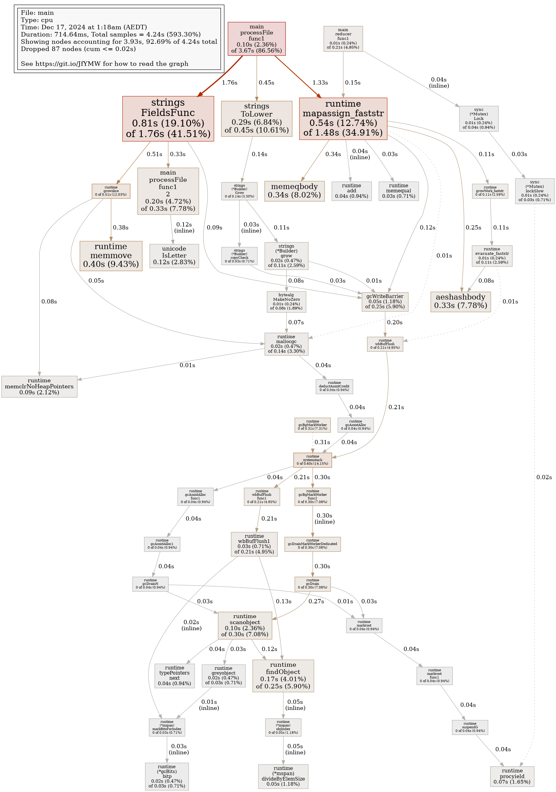
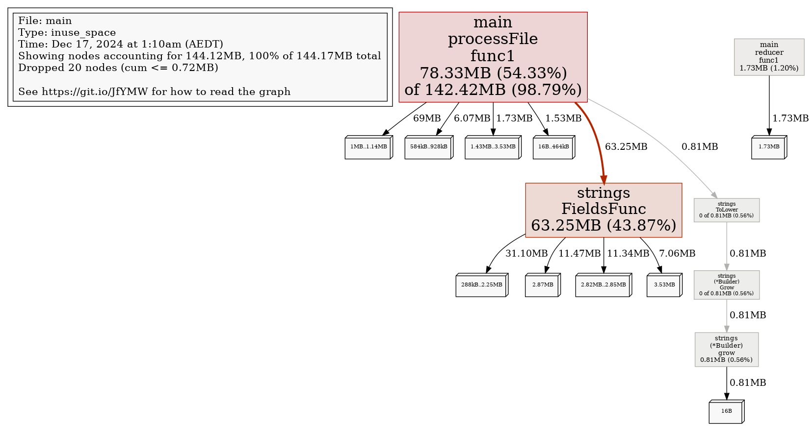

# WordCounter with MapReduce

## Project Overview

This project is a **parallel word counter** that utilizes a MapReduce-inspired approach to count individual word occurrences across multiple text files. It is optimized for speed, scalability, and accuracy, using Go's concurrency primitives.

### Key Features

- **MapReduce Paradigm**: Distributes file processing (Map phase) and aggregates results in parallel (Reduce phase).
- **Concurrency**: Implements worker pools and multiple reducers to fully utilize available CPU cores.
- **Profiling Support**: Supports CPU, memory, block, and execution trace profiling.
- **Fault Tolerance**: Graceful error handling and panic recovery to ensure robust execution.

---

## Improvements Over the Original Version

<https://github.com/striversity/gotr/blob/master/018-profiling/ep18.1-word-count/examples/ex04/main.go>
This project builds upon the original implementation and introduces significant improvements:

### 1. **Punctuation Bug Fix**

- **Problem**: The original implementation used `bufio.Scanner` with `ScanWords`, which mixed up punctuation with the words.
- **Improvement**: Replaced the word splitting logic with `bufio.Reader` and `strings.FieldsFunc` to accurately handle punctuation.

   **Benefit**: Words are extracted more cleanly, ensuring correctness in word counts.

---

### 2. **Dynamic Worker Allocation**

- **Problem**: The original implementation had a fixed worker count (default 4), which could underutilize or overwhelm system resources.
- **Improvement**: Dynamically sets the number of workers to `runtime.NumCPU()` to match the number of CPU cores.

   **Benefit**: Optimized parallelism for maximum performance across different hardware.

---

### 3. **Testing Suite**

- **Addition**: Implemented unit tests to validate correctness across edge cases:
  - Mixed casing of words
  - Handling punctuation
  - Accuracy of total word count

   **Benefit**: Ensures program correctness and reliability under varying input conditions.

---

### 4. **Multiple Reducers with Synchronization**

- **Problem**: The original implementation had a single reducer, which created a bottleneck when aggregating results.
- **Improvement**: Introduced **multiple reducers**, each processing partial results in parallel. A `sync.Mutex` ensures safe concurrent access to the final result map.

   **Benefit**: Reduced contention during result aggregation and improved overall execution time.

---

### 5. **Eliminating Serial Bottlenecks (Amdahl's Law and Gustafson's Law)**

#### **Performance Optimization Using Amdahl's Law**

- **Amdahl's Law**: This principle states that the overall speedup of a program is limited by the fraction of its execution time that is serial (not parallelizable). In simple terms, the more code you can parallelize, the greater the speedup; however, the serial sections of code become the bottleneck as parallelism increases.

- **Problem**: In the original code, **result printing** was performed sequentially after all files were processed. As the workload grew, this serial phase began to limit performance improvements, regardless of how many workers were employed.

- **Improvement**: Getting rid of serial bottlenecks, the program achieves better parallel efficiency, leading to faster processing of large workloads.  

#### **Leveraging Gustafson's Law for Workload Scalability**

- **Gustafson's Law**: Unlike Amdahl's Law, Gustafson's Law considers the scalability of workloads. It states that as more processors (cores) become available, users can increase the problem size (e.g., larger datasets or more files) to achieve near-linear speedup.

- **Note for Users**: If you observe underutilized cores while profiling with tools like `go tool trace`, you can leverage Gustafson's Law by **increasing the number of text files** or scaling up the workload. This ensures that the available CPU cores are fully utilized, and the program achieves greater speedup as more work is distributed among workers.

#### **Practical Tip:**

Run `go tool trace` after profiling to identify underutilized cores. If some workers appear idle, scale up the workload by adding more files to process.

---

### 6. **Efficient File Reading Using Buffered Reader**

- **Original**: The previous implementation used `bufio.Scanner` with `ScanWords`, processing one word at a time.
- **Improvement**: Implemented chunked reading using `bufio.Reader` (1 MB chunks) and custom word splitting logic with `unicode` for identifying word boundaries.

   **Advantages of Buffered Reader**:

- Faster processing for large files due to reduced I/O calls.
- More control over word boundary handling.
- Improved memory efficiency.

   **Benefit**: Significant performance improvement when processing large files.

---

### 7. **Fault Tolerance and Panic Recovery**

- **Addition**: Workers are protected with `recover` mechanisms to gracefully handle unexpected panics without crashing the program.

   **Benefit**: Increased robustness when handling faulty or corrupt files.

---

### 8. **Profiling Support**

- Added versatile profiling options using `github.com/pkg/profile` and `runtime/trace`. Supported profiling types:
- CPU profiling
- Memory profiling
- Block profiling
- Execution tracing

   **Benefit**: Provides deep insights into performance bottlenecks and resource usage.

---

## How to Run the Application

### Prerequisites

- **Go**: Ensure Go is installed (version 1.19 or above).
- **Git**: For cloning the repository.

### Steps

1. Clone the repository:

   ```bash
   git clone <repository-url>
   cd <repository-folder>
   ```

2. Build the project:

   ```bash
   go build -o wordcounter .
   ```

3. Run the application:

   ```bash
   ./wordcounter testdata/*
   ```

4. Profiling options:
   - To enable profiling, pass the desired profile flag:

     ```bash
     ./wordcounter -w 4 -cpuprofile cpu.prof file1.txt file2.txt
     ./wordcounter -memprofile mem.prof file1.txt
     ```

5. Run tests:

   ```bash
   go test -v
   ```

---

## Example Usage

**Command:**

```bash
./wordcounter sample1.txt sample2.txt
```

**Output:**

```bash
Processing took: 150ms
```

---

## Profiling the Application

To analyze performance, enable profiling:

1. **CPU Profiling**

   ```bash
   ./wordcounter -cpuprofile cpu.prof sample.txt
   ```

   Analyze with:

   ```bash
   go tool pprof <cpu.prof_file>
   ```

2. **Memory Profiling**

   ```bash
   ./wordcounter -memprofile mem.prof sample.txt
   ```

   Analyze with:

   ```bash
   go tool pprof <mem.prof_file>
   ```

3. **Execution Trace**

   ```bash
   ./wordcounter -trace trace.out sample.txt
   ```

   Analyze with:

   ```bash
   go tool trace trace.out
   ```

---

## Testing

Run the unit tests:

```bash
go test -v
```

**Example Output:**

```bash
=== RUN   TestWordCount
--- PASS: TestWordCount (0.02s)
PASS
ok   wordcounter   0.02s
```

---

## Future Improvements

- **Distributed Processing**: Enable the program to run across multiple machines for even larger datasets.
- **Customizable Reducer Strategy**: Allow the user to choose between single or multiple reducers.
- **Integration with Cloud Storage**: Support reading files from S3 or other cloud storage services.

---

## Acknowledgments

- Inspired by the MapReduce paradigm and the original [GoTR word count implementation](https://github.com/striversity/gotr).

## Profiling and Tracing Results**

To measure the performance and validate the improvements in this project, **CPU profiling**, **memory profiling**, and **execution tracing** were conducted at various stages of optimization (stored in assets directory). The following assets highlight key insights from each profiling step:

### **6.1 CPU and Memory Profiling**

- **cpuprofile.png**:  
   Displays the **CPU usage profile** during the execution of the word counting task. This highlights areas where CPU cycles were consumed, helping identify bottlenecks and opportunities for parallel optimization.

- **memprofile.png**:  
   Shows the **heap memory allocation** profile. It illustrates how memory usage evolves during execution, ensuring efficient resource management in the program.

- **final_output.png**:  
   Presents the final aggregated word count results after processing input files.

---

### **6.2 Execution Tracing Over Optimization Steps**

Execution traces were captured using **`go tool trace`** to monitor goroutines, worker utilization, and runtime behavior. The following images demonstrate the incremental optimizations:

1. **trace1_original.png**:  
   - **Initial implementation** with suboptimal worker count and inefficient processing. Some workers remain idle, revealing underutilization of CPU cores.(~1200ms)

2. **trace2_numCPUworkers.png**:  
   - Optimized worker count using **`runtime.NumCPU()`**. Adding multiple workers for **`reduce`** processing. This step ensures that the number of workers matches the number of CPU cores for maximum parallel efficiency.(~900ms)

3. **trace3_afterprocfileoptimization.png**:  
   - Improvements in the **file processing logic** reduced delays and improved worker utilization. Tracing shows fewer idle periods for goroutines.(~800ms)

4. **trace4final_readerchunking.png**:  
   - Final optimization using **buffered readers with chunking** for efficient file reading. Worker performance and CPU usage are further enhanced, as observed in the trace.(~600ms)

---

### **6.3 Visual Recap**

| **Profiling / Trace Step**                | **Description**                     | **Image**                  |
|------------------------------------------|------------------------------------|----------------------------|
| CPU Profiling                            | Highlights CPU usage during tasks   |    |
| Memory Profiling                         | Heap memory allocation insights     |  |
| Execution Trace (Original)               | Suboptimal worker utilization       |   |
| Execution Trace (Optimized Workers)      | Workers set to `runtime.NumCPU()`   |  |
| Execution Trace (File Processing Fix)    | Improved processing logic           |  |
| Execution Trace (Reader Chunking Final)  | Efficient buffered reader chunking  |  |

---

By analyzing these profiles and traces, bottlenecks were systematically identified and optimized to improve CPU efficiency, memory management, and overall program performance.
